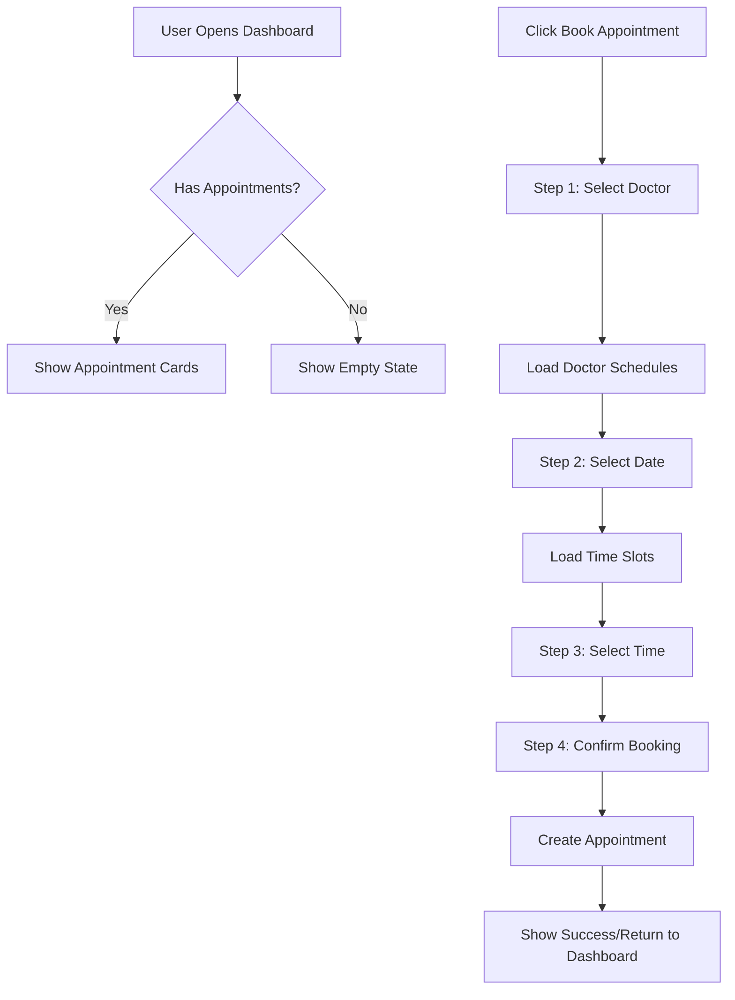

# 🏥 PharmaConnect - Appointment Booking System

A comprehensive appointment management system inspired by theater booking interfaces, providing an intuitive and modern experience for patients to book appointments with doctors.

## ✨ Features

### 🎭 Theater-Style Booking Experience
- **Doctor Selection Grid**: Visual cards displaying available doctors with ratings and specializations
- **Calendar-Style Schedule Selection**: Date picker with availability indicators
- **Time Slot Matrix**: Theater-style seat selection for appointment time slots
- **Multi-Step Booking Process**: Guided workflow similar to ticket booking systems

### 📅 Appointment Management
- **My Appointments**: View all scheduled, completed, and cancelled appointments
- **Real-time Status Updates**: Live appointment status tracking
- **Online & In-Person Options**: Support for both consultation types
- **Meeting Integration**: Direct links for online consultations

### 🎨 Modern UI/UX
- **Material-UI Components**: Professional medical interface design
- **Responsive Design**: Seamless experience across desktop and mobile
- **Interactive Animations**: Smooth transitions and hover effects
- **Color-Coded Status**: Visual indicators for different appointment states

## 🏗️ Component Architecture

### Main Dashboard
```
AppointmentDashboardUI/
├── MyAppointments Tab
│   ├── AppointmentCard (for each appointment)
│   ├── Status indicators
│   └── Action buttons
└── Book New Appointment Tab
    ├── Multi-step wizard
    ├── DoctorSelectionGrid
    ├── ScheduleSelectionCalendar
    ├── TimeSlotSelection
    └── BookingConfirmationModal
```

### Core Components

#### 1. DoctorSelectionGrid
- Grid layout of doctor cards
- Doctor profiles with photos, ratings, and specializations
- Selection states with visual feedback
- Hover effects and animations

#### 2. ScheduleSelectionCalendar
- Calendar-style date selection
- Availability indicators (available/busy/past)
- Session duration information
- Theater-inspired date display

#### 3. TimeSlotSelection
- Time slots organized by time of day (Morning/Afternoon/Evening)
- Theater-style slot visualization
- Real-time availability status
- Color-coded booking states
- Floating action button for booking

#### 4. BookingConfirmationModal
- Multi-step booking process
- Appointment type selection (Online/In-Person)
- Notes and special instructions
- Booking confirmation with summary

## 🎯 Theater Booking Inspiration

The interface draws inspiration from modern theater booking systems:

### Visual Design
- **Seat Selection Style**: Time slots displayed as selectable seats
- **Color Coding**: Green (available), Orange (booked), Red (unavailable)
- **Selection Feedback**: Pulsing animations and selection rings
- **Grid Layout**: Organized rows and columns for easy navigation

### User Flow
1. **Choose Performance** → **Select Doctor**
2. **Pick Date** → **Choose Schedule**  
3. **Select Seats** → **Pick Time Slots**
4. **Confirm Booking** → **Complete Appointment Booking**

### Interactive Elements
- Hover effects on selectable items
- Selection states with visual feedback
- Multi-step progress indicators
- Confirmation dialogs with booking summaries

## 🔄 Data Flow



## 🎨 Design Tokens

### Colors
- **Primary**: `#1976d2` (Medical Blue)
- **Success**: `#2e7d32` (Available Green)
- **Warning**: `#ed6c02` (Booked Orange)
- **Error**: `#d32f2f` (Unavailable Red)
- **Info**: `#0288d1` (Info Blue)

### Status Indicators
- **Available**: Green background, available icon
- **Booked**: Orange background, person icon
- **Completed**: Blue background, check icon
- **Cancelled**: Red background, cancel icon

## 🚀 Usage

### Basic Implementation
```tsx
import AppointmentDashboardUI from '@/app/user/appointment/module/ui/appointment-dashboard-ui';

function PatientDashboard() {
  return <AppointmentDashboardUI />;
}
```

### Custom Booking Flow
```tsx
import { 
  DoctorSelectionGrid, 
  ScheduleSelectionCalendar, 
  TimeSlotSelection,
  BookingConfirmationModal 
} from '@/components/forms';
```

## 📱 Responsive Features

- **Desktop**: Full multi-column layout with side-by-side components
- **Tablet**: Adaptive grid layouts with touch-friendly interactions
- **Mobile**: Stacked layout with swipe gestures and FAB for quick actions

## 🔮 Future Enhancements

- [ ] Calendar integration (Google Calendar, Outlook)
- [ ] SMS/Email appointment reminders
- [ ] Video consultation interface
- [ ] Prescription management integration
- [ ] Multi-language support
- [ ] Advanced filtering and search
- [ ] Doctor availability predictions
- [ ] Waiting list functionality

## 🎭 Theater Booking References

This system takes inspiration from:
- **Cinema booking systems**: Time slot selection similar to movie showtimes
- **Concert venues**: Seat selection with real-time availability
- **Event ticketing**: Multi-step checkout process with confirmation
- **Restaurant reservations**: Date and time selection workflows

The result is a familiar, intuitive interface that patients can easily understand and navigate, making medical appointment booking as simple as booking entertainment tickets.
